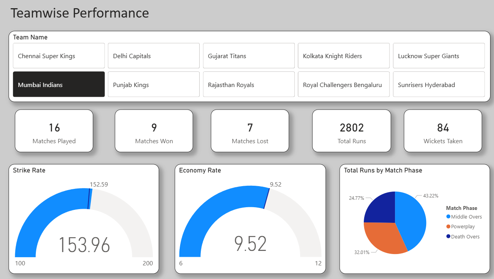
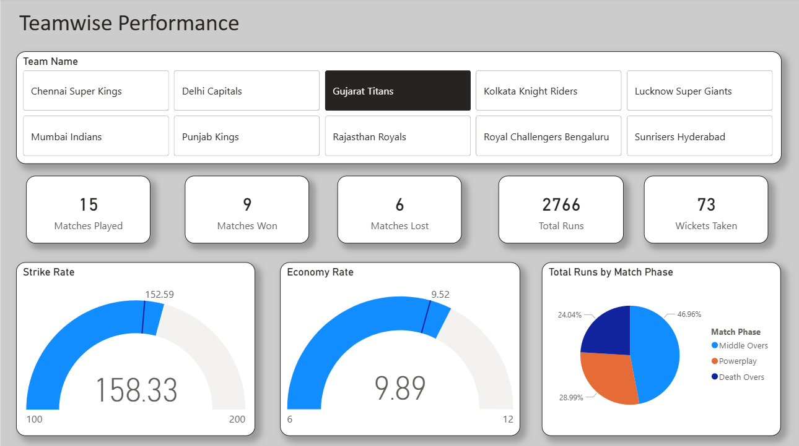
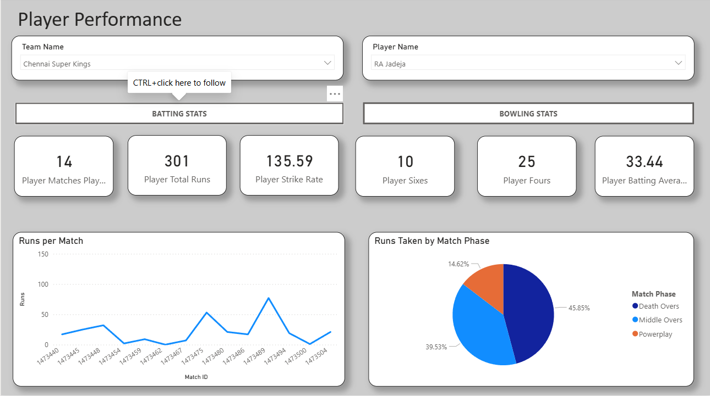
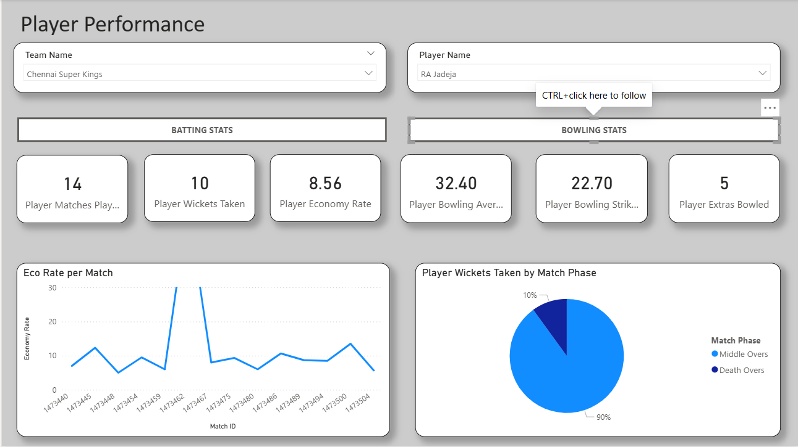
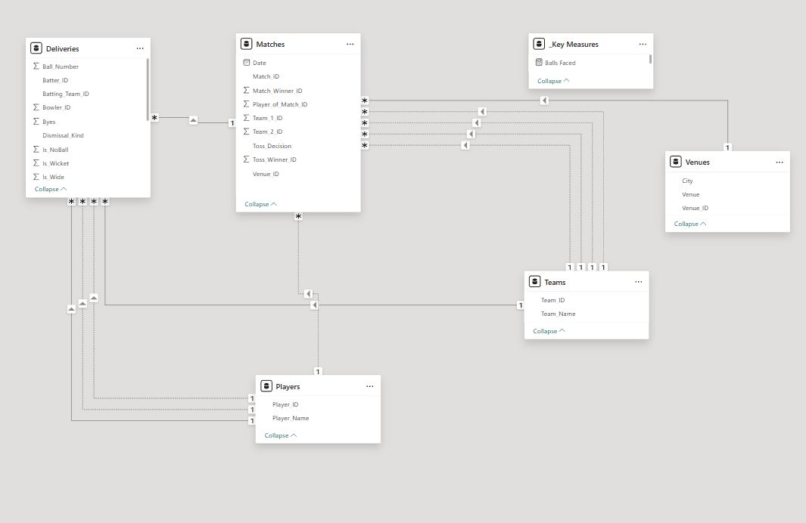
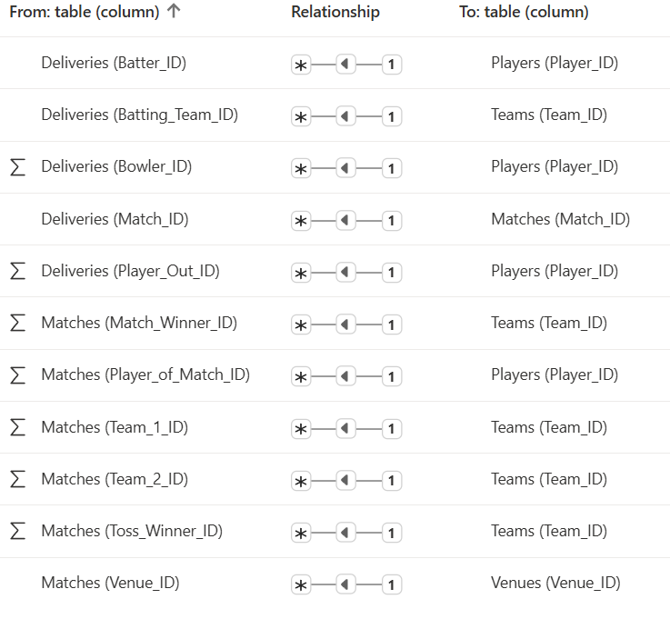

# IPL 2025 Performance Analytics 🏏

## Overview
This project provides an in-depth, interactive analysis of player performances for IPL 2025. It features a complete data pipeline, starting from data extraction and transformation using Python, through to complex data modeling and visualization in Power BI. 

The dashboard solves common sports analytics modeling challenges—such as separating a player's batting and bowling contexts when filtering by franchise—using advanced DAX techniques.

## Repository Contents
* **`ipl_2025.ipynb`**: The Jupyter Notebook (originally Python script) containing the data extraction, cleaning, and transformation logic using Pandas.
* **`Deliveries.csv`** (and other CSVs): The cleaned datasets generated by the Python script, ready for ingestion.
* **`IPL 2025.pbix`**: The fully interactive Power BI report containing the data model, DAX measures, and dashboard visuals.
* **Screenshots (`IPL1p1.png` - `IPL1p6.png`)**: Static previews of the dashboard views for quick reference.

## Methodology & Architecture

### 1. Data Preparation (Python)
The foundational data manipulation was handled in Python. The notebook processes raw match data, handling granular ball-by-ball details, calculating extras, and structuring the data into a relational format suitable for BI modeling.

### 2. Data Modeling & Advanced DAX (Power BI)
A significant challenge in cricket data modeling is the "Team Filter Clash" (e.g., filtering for "Mumbai Indians" blanks out Jasprit Bumrah's bowling stats because he bowls *against* other teams, not for them in the delivery context). 

This was resolved using advanced DAX:
* **Context Transition:** Extensive use of `USERELATIONSHIP` to dynamically switch active relationships between `Batter_ID` and `Bowler_ID` within the same `Deliveries` fact table.
* **Filter Modification:** Implementation of `REMOVEFILTERS('Teams')` to isolate player-specific metrics from page-level team slicers, ensuring accurate career statistics.
* **Custom Metrics:** Developed specialized measures for calculating Economy Rates, Bowling Averages, and Strike Rates, accurately handling edge cases like zero-run dismissals ("ducks") and isolating legal deliveries from extras.

## Dashboard Features
* **Dynamic View Switching:** Utilizes Power BI Bookmarks and Buttons to seamlessly toggle between a player's Batting Profile and Bowling Profile on a single canvas.
* **Match Phase Analysis:** Tracks runs scored and conceded across different phases of the game (e.g., Powerplay, Death Overs).
* **Performance Consistency:** Line charts tracking run accumulation on a match-by-match basis, utilizing categorical X-axes to handle "Did Not Bat" scenarios gracefully.

## How to Run Locally
1. Clone this repository to your local machine.
2. Ensure you have Power BI Desktop installed to open the `IPL 2025.pbix` file.
3. If you wish to run the data pipeline, open `ipl_2025.ipynb` in Jupyter or VS Code, ensure you have `pandas` installed, and run the cells to generate the CSV files.

## Dashboard Previews

*(Below are previews of the interactive dashboard)*

**Overall Performance View**

**Detailed Player Metrics**

**Phase & Match Analysis**

